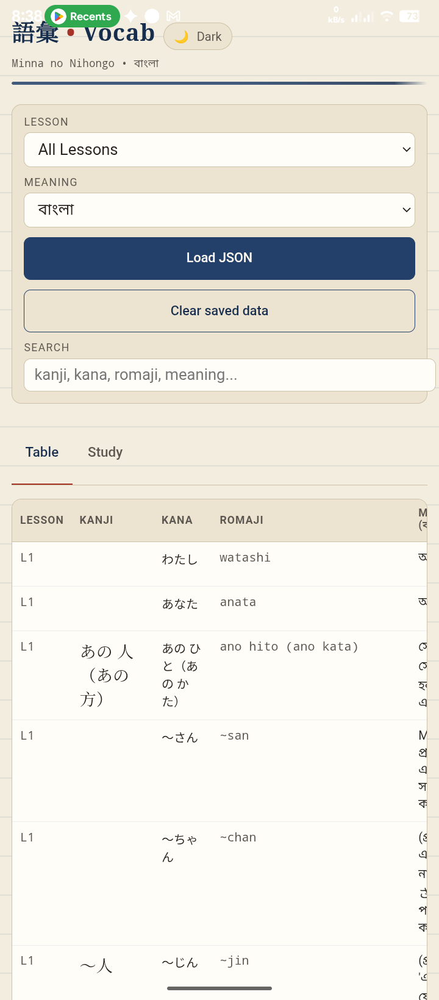
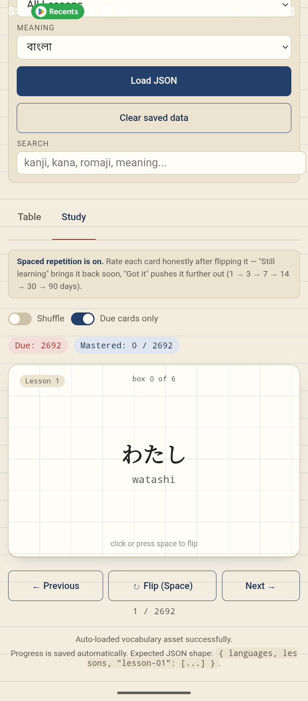
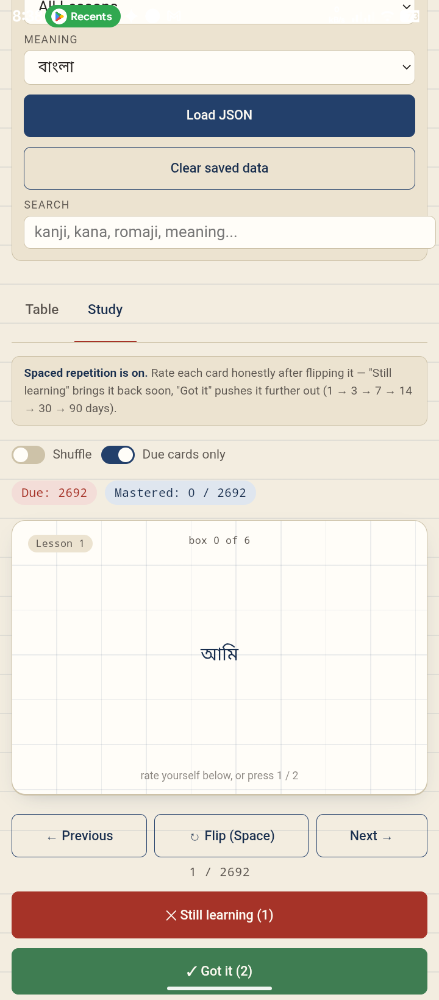

# 🇯🇵 Minna no Nihongo - Japanese Vocabulary Android App

An interactive, offline-first Android application designed to help Bangladeshi learners study Japanese vocabulary from the **Minna no Nihongo** series with Bangla and English translations. Built with Android Studio using WebView, HTML5, JavaScript, and custom JSON datasets.
<p align="center">
  
</p>
<p align="center">
  
</p>
<p align="center">
  
</p>

---

## ✨ Features

- 📱 **Offline First**: Runs completely offline without any internet connection.
- 🎴 **Interactive Flashcards**: Practice vocabulary with smooth card flipping (Front: Kanji/Kana, Back: Bangla & English meaning).
- 📊 **Table / Grid View**: Browse words neatly arranged by Lesson, Kanji, Kana, Romaji, and Bangla meanings.
- 🔍 **Instant Search**: Search words in real-time by Kanji, Kana, Romaji, or Bangla meanings.
- 🎯 **Lesson-wise Filter**: Easily switch between specific lessons (Lesson 1, Lesson 2, etc.) or view all lessons together.
- ⚡ **Lightweight & Fast**: HTML/JS interface rendered seamlessly via Android's native WebView.

---

## 🛠️ Tech Stack & Tools

- **IDE:** Android Studio
- **Language / Core:** Java / Kotlin (Android WebView Container)
- **Frontend UI:** HTML5, CSS3, JavaScript (ES6)
- **Data Store:** Local JSON (`minna_nihongo_bangla.json`)

---

## 📁 Repository Structure

```text
├── app/
│   └── src/
│       └── main/
│           ├── assets/
│           │   ├── index.html                  # Main Web UI
│           │   ├── style.css                   # Custom Styling
│           │   ├── app.js                      # App Logic & JSON Fetch
│           │   └── minna_nihongo_bangla.json   # Japanese Vocabulary Data
│           ├── java/com/example/app/
│           │   └── MainActivity.java           # WebView initialization
│           └── AndroidManifest.xml
├── build.gradle
└── README.md
